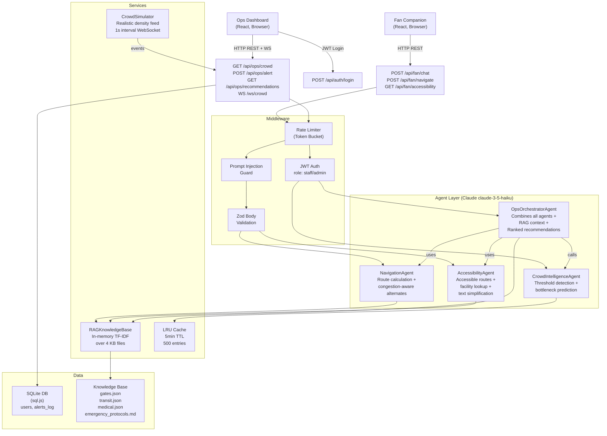

# StadiumPulse — Architecture

## Overview

StadiumPulse is a multi-agent GenAI system for FIFA World Cup 2026 stadium operations. It uses a layered backend architecture with a React frontend, all connected through a single Fastify REST + WebSocket server.

## Multi-Agent Flow



## Agent Descriptions

### NavigationAgent
- **System prompt**: Navigation specialist, returns JSON step-by-step directions
- **Input**: origin, destination, accessibility flag, live crowd snapshot
- **Logic**: Injects RAG context (gate map data), calls Claude, parses JSON response, falls back to static directions if LLM output is malformed
- **Output**: `NavigationAgentOutput` with primary route, optional alternate route, congestion level
- **Optimization**: Results cached for 5 minutes (crowd data clears cache)

### CrowdIntelligenceAgent
- **System prompt**: Crowd analytics specialist, returns structured JSON alerts
- **Input**: Array of `GateDensitySnapshot` from the simulator
- **Logic**: Pre-filters — if no gate > 80%, returns no-alert response WITHOUT calling the LLM (efficiency optimization). Otherwise, calls Claude with full snapshot data.
- **Thresholds**: 80% = HIGH, 92% = CRITICAL
- **Output**: `CrowdIntelligenceAgentOutput` with alerts, hotspots, recommendation

### AccessibilityAgent
- **System prompt**: Accessibility specialist for wheelchair, visual, hearing needs
- **Input**: Need type, nearest gate, optional text to reformat
- **Logic**: RAG retrieval focused on accessibility keywords, calls Claude, returns facilities + accessible route + audio description
- **Output**: `AccessibilityAgentOutput` with facilities, route, TTS-ready audio description

### OpsOrchestratorAgent
- **System prompt**: Operations commander, generates ranked staff actions
- **Input**: Full crowd snapshot, optional trigger gate
- **Logic**: Chains CrowdIntelligenceAgent first. If no alerts: returns no-action response without second LLM call. If alerts: retrieves emergency protocol RAG context, calls Claude with full situation, generates ranked recommendations.
- **Output**: `OpsOrchestratorAgentOutput` with ranked `OpsRecommendation[]` and summary

## RAG Knowledge Base

The knowledge base uses in-memory TF-IDF style retrieval (no external vector DB required):

1. **Document ingestion**: All 4 KB files are chunked at startup (~500 chars each)
2. **Keyword extraction**: Stop-word filtered keyword lists per chunk
3. **Scoring**: `matches / sqrt(doc_keywords_count)` — simple but effective for structured data
4. **Caching**: All retrieval results cached in LRU cache by normalized query

**Production upgrade**: Replace with Chroma (`chromadb` npm) or Pinecone. The `retrieve()` interface is identical — only the implementation of `RAGKnowledgeBaseService` changes.

## Data Flow: Fan Chat Request

```
Browser → POST /api/fan/chat
  → Rate limiter (token bucket, per-IP)
  → Prompt injection guard (sanitize + detect patterns)
  → Zod validation (message max 500 chars, language enum)
  → FanChatController
    → RAGKnowledgeBase.retrieve(message, topK=4)
    → LRU cache check (hit → return immediately)
    → Claude API (claude-3-5-haiku-20241022, max 800 tokens)
    → validateLLMOutput() (strip scripts, redact system leak)
    → Cache response
  → JSON response to browser
```

## Data Flow: Ops Alert (WebSocket + REST)

```
CrowdSimulator (1s tick) → emits 'snapshot' → WebSocket broadcast
  → OpsOrchestratorAgent detects threshold crossing
  → POST /api/ops/alert (staff JWT required)
    → Inject surge on simulator
    → runOpsOrchestratorAgent()
      → runCrowdIntelligenceAgent() → Claude API
      → RAGKnowledgeBase.retrieve("gate diversion emergency protocols")
      → Claude API (OPS system prompt + ranked recommendations)
    → logAlert() → SQLite
  → Response: OpsOrchestratorAgentOutput
```

## Technology Decisions

| Decision | Rationale |
|---|---|
| Fastify over Express | 2x throughput, built-in schema validation, native async |
| sql.js over better-sqlite3 | Pure JS, works on Windows without C++ build tools |
| In-memory TF-IDF over Chroma | Zero config, zero dependencies, sufficient for structured KB |
| LRU cache over Redis | Zero config for dev/hackathon; Redis is drop-in for production |
| claude-3-5-haiku over claude-3-5-sonnet | 5x cheaper, 3x faster, sufficient quality for structured JSON output |
| Web Speech API over paid TTS | No API key, works in Chrome/Edge, multilingual |
